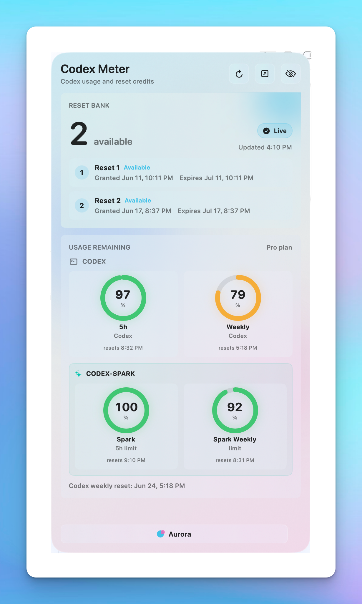
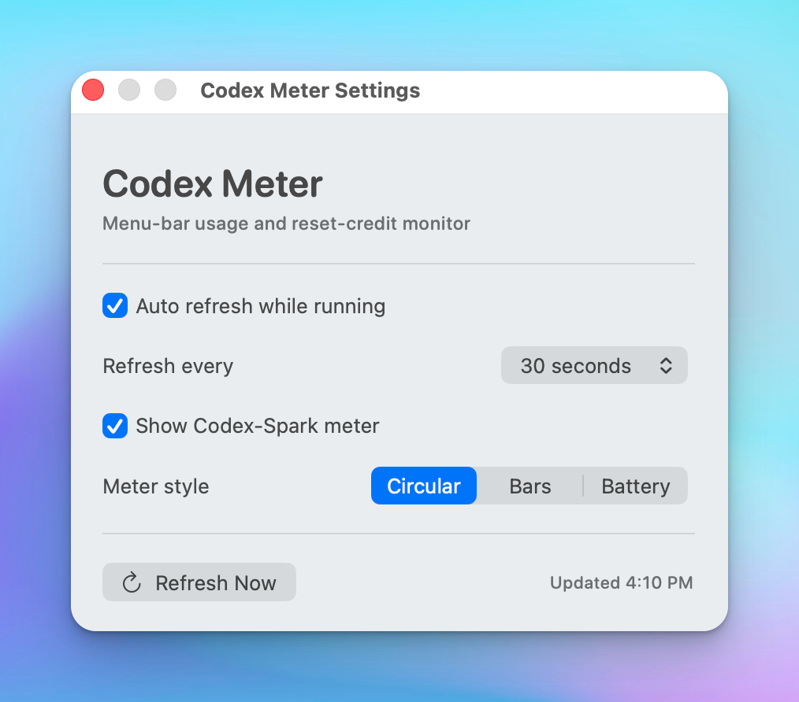
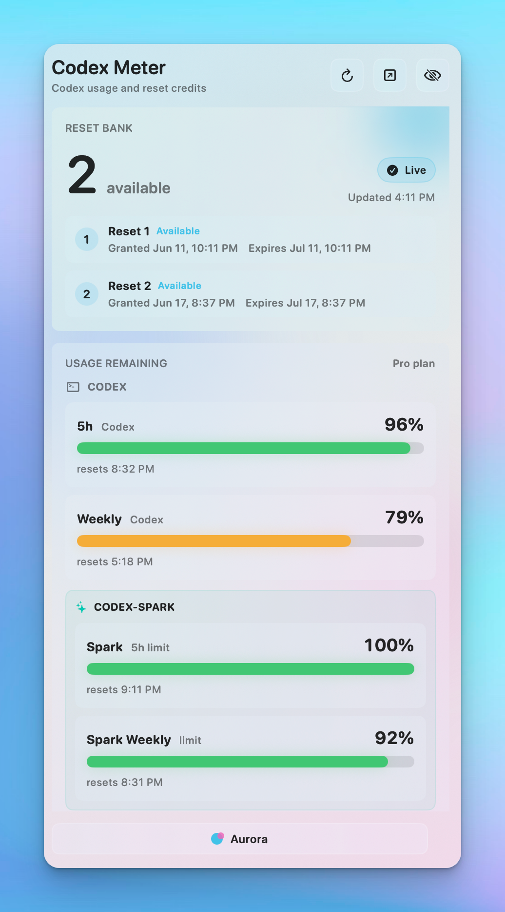
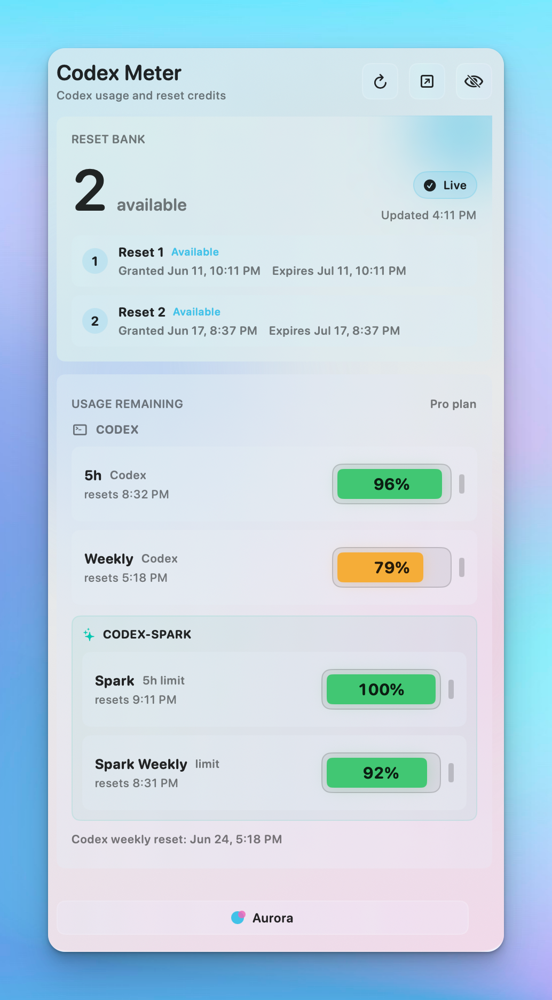

# Codex Meter

Codex Meter is a native macOS menu-bar widget for people who use Codex heavily and want a fast glance at usage, reset credits, and reset windows.

It reads your existing local Codex session, floats in the top-right corner, and shows the current state without adding an account system, analytics, or external tracking.

## Highlights

- **Reset Bank**: available reset-credit count, granted dates, and expiration dates.
- **Usage meters**: Codex 5h, Codex weekly, Codex-Spark 5h, and Codex-Spark weekly when the endpoint returns it.
- **Three meter styles**: circular, horizontal bars, and battery.
- **Health colors**: green when plenty remains, amber as usage drops, red near depletion.
- **Resizable floating panel**: lives in the top-right corner and can reset to its default size and position.
- **Menu-bar controls**: show/hide, refresh, reset position and size, settings, quit.
- **Local-first privacy**: no analytics, no third-party SDKs, no token logging.

## Screenshots

| Circular meters | Settings |
| --- | --- |
|  |  |

| Bars | Battery |
| --- | --- |
|  |  |

## Important Disclaimer

Codex Meter is not affiliated with, endorsed by, or supported by OpenAI.

It uses undocumented ChatGPT backend endpoints that may change or stop working. The app is intentionally built as a small open-source utility so the community can adapt quickly if the payload shape changes.

## How It Works

Codex Meter reads `~/.codex/auth.json` and uses the local access token in memory to call:

```text
GET https://chatgpt.com/backend-api/wham/usage
GET https://chatgpt.com/backend-api/wham/rate-limit-reset-credits
```

The token is only sent as an `Authorization: Bearer` header to those ChatGPT endpoints. It is not printed, displayed, logged, persisted by the app, or sent to any non-ChatGPT domain.

The app stores only lightweight UI preferences in `UserDefaults`, including:

- color mood
- auto-refresh enabled
- refresh interval
- meter style
- whether to show Codex-Spark meters

## Interface

For a fuller behavior map, see [docs/APP_FUNCTIONS.md](docs/APP_FUNCTIONS.md).

### Widget Buttons

- Refresh: immediately reloads usage and reset-credit data.
- Reset position and size: moves the widget back to the top-right corner and restores the default size.
- Hide: closes the floating panel while keeping the menu-bar app running.

### Menu Bar

- Left-click the menu-bar icon to show or hide Codex Meter.
- Right-click or Control-click the menu-bar icon to open the menu.
- Menu actions include Refresh Now, Reset Position and Size, Settings, and Quit.

### Settings

Settings let users choose:

- auto-refresh on/off
- refresh interval
- whether to show Codex-Spark meters
- meter style: Circular, Bars, or Battery

## Usage Semantics

The app displays remaining capacity, not consumed capacity.

- `100%` means the window appears unused or fully available.
- `0%` means the backend reports the window as depleted.
- Codex-Spark 5h is shown only when the endpoint returns a Spark primary window.
- Codex-Spark weekly is shown only when the endpoint returns a Spark secondary window.
- Weekly reset text comes from the endpoint's reset timestamp.

## Download

Download the latest release asset:

[CodexMeter-0.2.0.dmg](https://github.com/TheoPsycheMedia/codex-meter/releases/download/v0.2.0/CodexMeter-0.2.0.dmg)

To verify the download, use the published checksum:

[CodexMeter-0.2.0.dmg.sha256](https://github.com/TheoPsycheMedia/codex-meter/releases/download/v0.2.0/CodexMeter-0.2.0.dmg.sha256)

Open the DMG, drag `Codex Meter.app` into Applications, then launch it from there.

Current local builds are ad-hoc signed and not notarized. A public release should be signed with a Developer ID Application certificate and notarized before broad distribution.

## Build From Source

Requirements:

- macOS 13 or newer
- Xcode command line tools
- SwiftPM

Build:

```bash
swift build
```

Build and launch as a `.app` bundle:

```bash
./script/build_and_run.sh
```

Build, launch, and verify the app process is running:

```bash
./script/build_and_run.sh --verify
```

Create a local DMG:

```bash
./script/package_dmg.sh
```

## Project Structure

```text
Sources/CodexMeter/App/          App delegate and app entrypoint
Sources/CodexMeter/Controllers/  AppKit panel and settings window controllers
Sources/CodexMeter/Models/       Decodable response models and UI enums
Sources/CodexMeter/Services/     Auth token reader and endpoint clients
Sources/CodexMeter/Stores/       Observable widget state and preferences
Sources/CodexMeter/Support/      Menu-bar icon and screen placement helpers
Sources/CodexMeter/Views/        SwiftUI widget and settings views
Resources/                       App icon assets
script/                          Build and launch helper
docs/                            Architecture, release notes, and media
```

## Contributing

Contributions are welcome. Good first issues include:

- launch at login
- alternate corner positions
- keyboard shortcuts
- signed/notarized release workflow
- endpoint payload compatibility fixes
- accessibility pass for VoiceOver labels and keyboard flow

Start with [CONTRIBUTING.md](CONTRIBUTING.md).

## Privacy And Security

- Read [PRIVACY.md](PRIVACY.md) before changing auth or networking behavior.
- Read [SECURITY.md](SECURITY.md) before reporting token or endpoint vulnerabilities.
- Never include `~/.codex/auth.json`, tokens, cookies, account ids, or raw private endpoint responses in issues.

## License

MIT. See [LICENSE](LICENSE).
